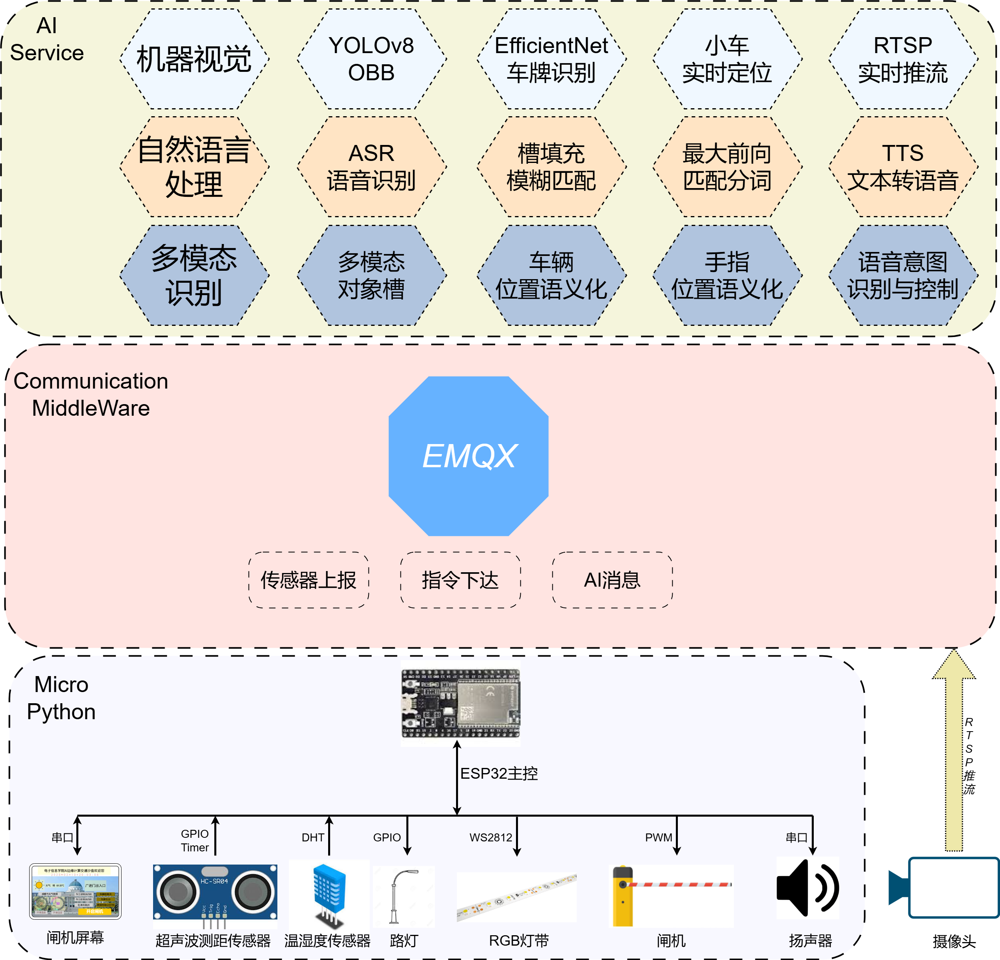

# Multi-modal-Sandtable
# 🌍 智慧沙盘多模态交互系统

> 🚗🎤💡 集 **实时监控**、**智能识别**、**语音交互** 与 **多模态联动** 于一体的智慧沙盘项目

---

## 📸 项目鸟瞰图


---

## 🧠 项目简介

本项目构建了一个集 **人工智能、物联网、语音识别、视觉检测与多模态交互** 于一体的智慧沙盘系统。  
系统实现了 **环境感知、语义定位、语音问询、车辆识别、联动控制** 等多种功能，  
在技术架构上兼顾了 **前沿性、稳定性与教学可用性**。

---

## 🏗️ 系统架构



### 🔹 架构核心思路

系统的核心目标是实现 **信息高速传递** 与 **多层数据深度融合**。  
通过 RTSP、MQTT、HTTP 等多种通信协议，实现视频、传感器、控制指令的高效交互。

---

## ⚙️ 模块说明

### 🤖 AI 模块

- **目标检测**：采用 `YOLOv8 旋转目标检测` 实现对手指与小车的实时定位。  
- **点面语义计算**：结合建筑物与道路数据，通过射线法判断点是否位于多边形内，实现语义化位置识别。  
- **车牌分类**：基于 `YOLO` 裁剪车辆区域，接入 `EfficientNet` 实现车牌识别与分类，构建智慧停车系统。  
- **语音理解与槽填充**：  
  - 使用 ASR 模型进行语音转文本  
  - LLM 进行语义理解与槽位填充  
  - 与视觉模型联动实现“手指+语音”多模态问询。

> 🗣️ 示例交互：  
> “请问一号小车在哪里？” → 系统返回「一号小车位于主干道东侧靠近教学楼入口区域」

---

### 🔌 硬件层（IoT）

基于 **ESP32 + MicroPython** 的分布式物联网系统，所有状态与控制均通过 `MQTT` 实时发布。

- 🌡️ 环境监测：温湿度、二氧化碳、PM2.5 实时上传  
- 🚦 信号灯控制：红绿灯、路灯、灯带、闸机  
- 💬 控制与反馈：状态信息与指令全双工传输  
- ⚙️ 通信协议：MQTT 提供轻量化、高可靠的数据传递机制

---

### 💻 前端可视化

采用 **Vue** 实现的大屏可视化界面，整合 YOLO、MQTT、RTSP 数据流。

- 🛰️ 实时绘制检测框，展示车辆与手指位置  
- 🛣️ 动态显示道路与红绿灯秒数  
- ☁️ 实时天气与环境信息接入  
- 📡 支持多源数据融合与状态联动显示

---

### 📱 安卓控制端

基于 **Android Studio** 开发，实现沙盘设备的便捷控制与消息交互。

- 🔔 发布与订阅 MQTT 消息  
- 💡 控制灯光与闸机  
- 🧭 接收实时设备状态与报警信息  

---

### 🚗 智能小车系统

基于 **STM32F103C8T6 + Keil5** 构建的自主巡线与交互小车：

- 🧲 磁导巡线 + 红外避障逻辑  
- 📶 外接 ESP8266 实现 MQTT 联动  
- 🪪 支持 RFID 定位与红绿灯识别  
- 🚦 可实现信号灯判定与路径规划  

---

## 🧩 系统特性

| 功能类别 | 描述 |
|-----------|------|
| 🔍 视觉识别 | YOLOv8 旋转目标检测 + 车牌识别 |
| 🗣️ 语音交互 | ASR + LLM 槽填充 + 多模态语义融合 |
| 💡 控制逻辑 | MQTT 实时指令下发与状态反馈 |
| 🌦️ 环境集成 | 温湿度、空气质量、天气信息接入 |
| 🚘 智能联动 | 红绿灯-车辆-灯光-语音全流程联动 |

---

## 🧩 技术栈总览

| 模块 | 技术 |
|------|------|
| 🎯 AI | Python, YOLOv8, OpenCV, EfficientNet |
| 🧠 NLP | ASR, Jieba, LLM, Slot Filling |
| 🌐 通信 | MQTT, RTSP, HTTP |
| 💡 硬件 | ESP32, MicroPython, DHT11, CO₂ Sensor, PM2.5 |
| 💻 前端 | Vue, ECharts, RTSP Stream, MQTT.js |
| 📱 移动端 | Android Studio, MQTT Client |
| 🚗 控制端 | STM32F103C8T6, ESP8266, RFID |

---

## 🔄 系统联动示例

```mermaid
sequenceDiagram
    participant 用户
    participant 语音模块
    participant AI视觉模块
    participant MQTT中枢
    participant 沙盘设备

    用户->>语音模块: 语音输入 “打开教学楼灯光”
    语音模块->>AI视觉模块: 槽填充 + 语义解析
    AI视觉模块->>MQTT中枢: 发布控制指令
    MQTT中枢->>沙盘设备: 执行灯光开启
    沙盘设备-->>MQTT中枢: 状态反馈
    MQTT中枢-->>前端显示: 灯光状态更新

